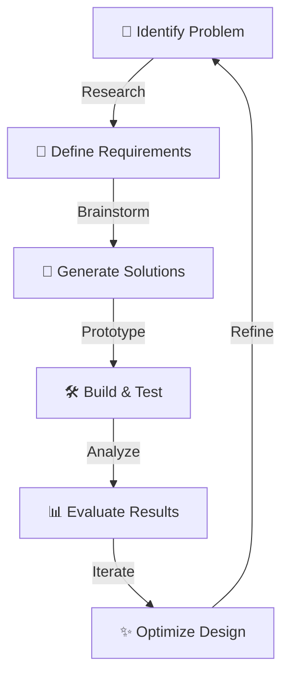

import Tabs from '@theme/Tabs';
import TabItem from '@theme/TabItem';

# 🛠️ Engineering Process

:::tip 💡 Engineering Excellence
Our engineering process is built on systematic problem-solving, iterative design, and data-driven decisions. Every challenge is an opportunity to innovate!
:::

## 🔄 Design Cycle

## 📋 Process Steps

<Tabs>
<TabItem value="identify" label="🔍 Problem Identification" default>

### Understanding the Challenge
- **Game Analysis**
  - Study rules and constraints
  - Identify scoring opportunities
  - Analyze field elements
- **Resource Assessment**
  - Available materials
  - Team capabilities
  - Time constraints

</TabItem>
<TabItem value="design" label="✏️ Design Phase">

### Design Development
- **Brainstorming Sessions**
  - Team ideation
  - Concept sketches
  - Solution evaluation
- **CAD Modeling**
  - 3D prototypes
  - Assembly testing
  - Interference checks

</TabItem>
<TabItem value="build" label="🔨 Build Phase">

### Construction & Testing
- **Prototype Development**
  - Rapid prototyping
  - Component testing
  - Assembly validation
- **Iteration Cycles**
  - Performance testing
  - Design refinement
  - Optimization

</TabItem>
</Tabs>

## 📊 Data-Driven Development

| Phase | Metrics | Tools Used |
|-------|---------|------------|
| Design | CAD iterations, Simulation results | Fusion 360, OnShape |
| Build | Build time, Material usage | Hand tools, 3D printer |
| Test | Success rate, Performance data | Data loggers, Sensors |
| Refine | Improvement metrics, Efficiency gains | Analysis software |

## 🎯 Success Criteria

:::note 🌟 Key Performance Indicators
We evaluate our designs based on:
:::

### 📈 Performance
- Speed and accuracy
- Reliability metrics
- Consistency scores
- Error rates

### 🛠️ Build Quality
- Material efficiency
- Structural integrity
- Maintenance needs
- Durability tests

### 💡 Innovation
- Unique solutions
- Creative approaches
- Novel mechanisms
- Elegant designs

## 🔄 Iteration Process

1. **Initial Design** ➡️ Basic prototype development
2. **Testing Phase** ➡️ Performance evaluation
3. **Data Analysis** ➡️ Identify improvements
4. **Refinement** ➡️ Implement changes
5. **Validation** ➡️ Verify enhancements

## 📝 Documentation

:::info 📚 Knowledge Management
Our engineering process is thoroughly documented through:
:::

### 📸 Visual Records
- Progress photos
- Video demonstrations
- CAD renderings

### 📊 Data Collection
- Performance metrics
- Test results
- Iteration logs

### 📓 Written Documentation
- Design decisions
- Process improvements
- Learning outcomes 