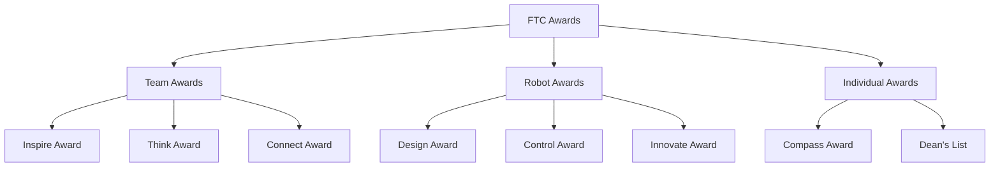

# FTC Awards Guide

:::tip Key Focus
Each award has specific criteria that must be met. Your portfolio and interview should strategically address these requirements while authentically representing your team's journey.
:::

## Award Categories Overview 🏆



## Inspire Award 🌟

### Requirements Checklist
- [ ] Role model team
- [ ] Strong performance in all award categories
- [ ] Engineering portfolio
- [ ] Team interview
- [ ] Robot performance

### Key Components
| Category | Requirements | Evidence |
|----------|--------------|----------|
| Team | Gracious Professionalism | Interactions, support |
| Robot | Innovation & performance | Match results, features |
| Outreach | Community engagement | Events, impact metrics |
| Portfolio | Documentation quality | Process, organization |

## Think Award 💭

### Engineering Focus
1. **Engineering Portfolio**
   - Clear documentation
   - Design process
   - Testing methods
   - Iteration cycles

2. **Design Journey**
   - Problem identification
   - Solution development
   - Testing results
   - Improvements

## Design Award 🎨

### Robot Excellence
1. **Design Elements**
   - CAD documentation
   - Physical prototypes
   - Testing data
   - Optimization process

2. **Innovation Features**
   - Unique solutions
   - Performance metrics
   - Reliability data
   - Efficiency measures

## Control Award 🎮

### Software Requirements
1. **Documentation**
   - Software architecture
   - Control systems
   - Autonomous features
   - Sensor integration

2. **Key Features**
   - Autonomous reliability
   - Driver assistance
   - Sensor utilization
   - Code efficiency

## Connect Award 🤝

### Community Impact
1. **Engagement**
   - STEM promotion
   - Community outreach
   - Team mentoring
   - Industry connections

2. **Sustainability**
   - Business plan
   - Team growth
   - Resource management
   - Long-term planning

## Innovate Award 💡

### Innovation Focus
1. **Creative Solutions**
   - Unique approaches
   - Problem-solving
   - Implementation
   - Results

2. **Documentation**
   - Innovation process
   - Testing data
   - Performance metrics
   - Impact assessment

## Portfolio Requirements 📚

### General Structure
```
┌─────────────────────┐
│ Cover Page          │
├─────────────────────┤
│ Team Section        │
├─────────────────────┤
│ Engineering Process │
├─────────────────────┤
│ Robot Design        │
├─────────────────────┤
│ Outreach Impact     │
└─────────────────────┘
```

### Content Requirements
1. **Team Information**
   - Team number
   - Location
   - Mission statement
   - Team photo

2. **Technical Content**
   - Design process
   - Engineering data
   - Testing results
   - Performance metrics

3. **Impact Documentation**
   - Outreach events
   - Community service
   - STEM promotion
   - Team growth

## Award Strategy Matrix 📊

### Documentation Focus

| Award | Primary Focus | Supporting Evidence |
|-------|--------------|-------------------|
| Inspire | Overall excellence | All categories |
| Think | Engineering process | Design iterations |
| Design | Robot innovation | CAD, prototypes |
| Control | Software/control | Code architecture |
| Connect | Community impact | Outreach metrics |
| Innovate | Creative solutions | Unique features |

## Success Strategies 💫

### Portfolio Development
1. **Organization**
   - Clear structure
   - Visual appeal
   - Professional format
   - Consistent style

2. **Content Quality**
   - Detailed documentation
   - Data support
   - Clear graphics
   - Professional writing

### Interview Preparation
1. **Team Presentation**
   - Award alignment
   - Key highlights
   - Team involvement
   - Professional delivery

2. **Q&A Readiness**
   - Technical knowledge
   - Impact metrics
   - Process understanding
   - Team collaboration

## Common Pitfalls ⚠️

### Portfolio Issues
- Missing requirements
- Poor organization
- Lack of data
- Unclear process
- Inconsistent format

### Interview Mistakes
- Time management
- Incomplete answers
- Technical confusion
- Poor team involvement
- Unprofessional behavior

## Best Practices 🎯

### Documentation
1. **Start Early**
   - Regular updates
   - Process photos
   - Data collection
   - Team input

2. **Stay Organized**
   - Clear sections
   - Consistent format
   - Easy navigation
   - Professional look

### Presentation
1. **Team Preparation**
   - Role assignments
   - Practice sessions
   - Feedback integration
   - Time management

2. **Professional Delivery**
   - Clear communication
   - Team involvement
   - Visual support
   - Enthusiasm

:::info Remember
Awards are recognition of your team's journey and impact. Focus on authentic documentation and presentation of your work rather than just meeting requirements.
::: 