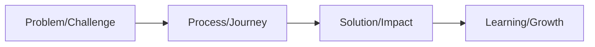

# Content Creation Guide

:::tip Key Principle
Great portfolio content tells a compelling story through a perfect blend of narrative, data, and visuals. Every page should serve a purpose and contribute to your team's story.
:::

## Content Planning Framework 📝

### 1. Story Architecture
Create a narrative that flows naturally through your portfolio:



### 2. Content Types Matrix

| Type | Purpose | Examples |
|------|----------|----------|
| Technical | Document engineering decisions | CAD designs, code architecture |
| Process | Show methodology | Design iterations, testing results |
| Impact | Demonstrate outcomes | Community reach, competition results |
| Growth | Highlight development | Skills gained, lessons learned |

## Writing Guidelines ✍️

### Voice and Tone
- **Professional**: Clear, concise language
- **Active Voice**: "We designed..." vs. "It was designed..."
- **Engaging**: Use strong verbs and specific examples
- **Authentic**: Share real experiences and challenges

### Structure Tips
1. Start with clear objectives
2. Use descriptive headings
3. Include topic sentences
4. Support claims with data
5. End sections with impact statements

## Visual Content Strategy 🎨

### Types of Visuals

| Visual Type | Best Used For | Tips |
|------------|---------------|------|
| Photographs | Physical progress | Clear, well-lit, focused |
| Diagrams | Technical concepts | Clean lines, labeled parts |
| Charts | Data presentation | Clear axes, readable text |
| Process Maps | Workflows | Logical flow, numbered steps |

### Design Elements
- **Color Scheme**: 2-3 primary colors
- **Typography**: Sans-serif for headings, serif for body
- **White Space**: 20-30% of page
- **Alignment**: Consistent grid system

## Documentation Methods 📸

### Real-Time Documentation
1. **Daily Progress**
   - Take photos of work sessions
   - Record meeting minutes
   - Log design decisions
   - Track metrics

2. **Process Recording**
   - Document iterations
   - Save failed attempts
   - Note improvements
   - Capture feedback

### Data Collection
Track and present:
- Build hours
- Test results
- Competition scores
- Outreach impact

## Content Organization 📊

### Page Layout Template
```
┌─────────────────────┐
│ Header + Team Info  │
├─────────────────────┤
│ Section Title       │
├────────┬────────────┤
│ Text   │ Supporting │
│ Content│ Visual     │
├────────┴────────────┤
│ Impact Statement    │
└─────────────────────┘
```

### Section Flow
1. Introduction/Context
2. Process/Methods
3. Results/Outcomes
4. Learning/Next Steps

## Writing Effective Sections 📖

### Technical Documentation
- Start with problem statement
- Explain design choices
- Show iterations
- Present results
- Include metrics

### Impact Stories
- Define initial goal
- Describe approach
- Share challenges
- Present outcomes
- Future plans

## Quality Control Checklist ✅

### Content Review
- [ ] Clear objectives
- [ ] Supported claims
- [ ] Consistent voice
- [ ] Error-free text
- [ ] Proper citations

### Visual Review
- [ ] Image quality
- [ ] Chart clarity
- [ ] Consistent style
- [ ] Proper labeling
- [ ] Professional layout

## Common Pitfalls to Avoid ⚠️

### Content Issues
- Vague descriptions
- Missing data
- Inconsistent terminology
- Unexplained acronyms
- Too much jargon

### Visual Issues
- Blurry images
- Busy backgrounds
- Unclear diagrams
- Poor contrast
- Inconsistent formatting

## Tips for Success 💡

1. **Start Early**
   - Document from day one
   - Regular updates
   - Continuous review

2. **Be Selective**
   - Quality over quantity
   - Relevant content only
   - Strong examples

3. **Show Progress**
   - Before/after comparisons
   - Iteration cycles
   - Growth metrics

4. **Tell Stories**
   - Personal experiences
   - Team challenges
   - Success moments

:::info Remember
Your portfolio is a living document. Regular updates and refinements will make it stronger and more representative of your team's journey.
::: 