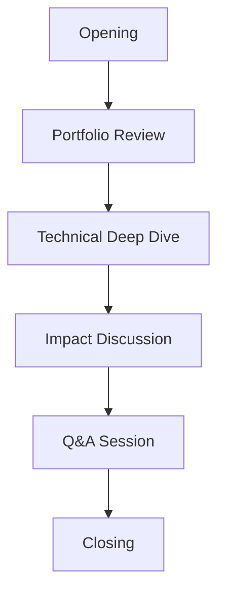

# Interview Preparation Guide

:::tip Success Key
The interview is your team's opportunity to bring your portfolio to life. Preparation, authenticity, and enthusiasm are your best tools for success.
:::

## Interview Framework 🎯

### Core Components


## Preparation Checklist ✅

### Team Preparation
- [ ] Portfolio review sessions
- [ ] Role assignments
- [ ] Practice presentations
- [ ] Mock interviews
- [ ] Feedback incorporation

### Individual Preparation
- [ ] Know your role
- [ ] Master your section
- [ ] Practice transitions
- [ ] Prepare examples
- [ ] Review metrics

## Interview Structure 🗣️

### 1. Opening (2-3 minutes)
- Team introduction
- Season overview
- Key achievements
- Portfolio roadmap

### 2. Portfolio Presentation (5-7 minutes)
- Engineering journey
- Design process
- Technical innovations
- Community impact

### 3. Q&A Session (5-10 minutes)
- Technical details
- Process explanations
- Impact clarification
- Future plans

## Role Distribution 👥

| Role | Responsibilities | Key Skills |
|------|-----------------|------------|
| Lead Presenter | Guide discussion, manage time | Clear communication, leadership |
| Technical Expert | Engineering details, design choices | Deep technical knowledge |
| Programming Lead | Software architecture, autonomous features | Coding expertise |
| Impact Speaker | Community outreach, team growth | Storytelling ability |
| Support Team | Examples, demonstrations | Quick thinking |

## Common Questions 💭

### Technical Questions
1. **Design Process**
   - "Walk us through your design iterations"
   - "What was your biggest technical challenge?"
   - "How did you test your solutions?"

2. **Engineering Decisions**
   - "Why did you choose this mechanism?"
   - "What alternatives did you consider?"
   - "How did you optimize performance?"

### Team Questions
1. **Organization**
   - "How does your team make decisions?"
   - "How do you distribute work?"
   - "What's your mentoring approach?"

2. **Growth**
   - "What's your biggest learning?"
   - "How do you handle setbacks?"
   - "What would you do differently?"

## Response Strategies 💡

### STAR Method
```
Situation    → Define the context
Task         → Explain the challenge
Action       → Describe your solution
Result       → Share the outcome
```

### Technical Explanations
1. Start with problem statement
2. Explain thought process
3. Detail implementation
4. Share results
5. Discuss learnings

## Presentation Tips 📊

### Visual Aids
- Portfolio highlights
- Physical examples
- Quick demonstrations
- Data visualizations
- Process diagrams

### Delivery Skills
- Clear articulation
- Confident posture
- Active listening
- Inclusive discussion
- Professional demeanor

## Do's and Don'ts ⚖️

### Do's ✅
- Share specific examples
- Use data to support claims
- Include all team members
- Show enthusiasm
- Maintain professionalism

### Don'ts ❌
- Interrupt judges
- Dominate conversation
- Use technical jargon
- Read from portfolio
- Forget team contributions

## Mock Interview Guide 🎭

### Setup
1. **Environment**
   - Quiet space
   - Timer setup
   - Portfolio copies
   - Recording device
   - Feedback forms

2. **Roles**
   - Mock judges
   - Team presenters
   - Observers
   - Timekeeper

### Practice Schedule
```
Week 1-2: Individual role practice
Week 3-4: Small group rehearsals
Week 5-6: Full team mock interviews
Week 7-8: Final refinements
```

## Handling Challenges 🎯

### Common Scenarios
1. **Difficult Questions**
   - Stay calm
   - Ask for clarification
   - Structure response
   - Be honest
   - Follow up if needed

2. **Technical Details**
   - Use simple explanations
   - Provide examples
   - Show iterations
   - Connect to results
   - Admit uncertainties

## Success Metrics 📈

### Key Indicators
- Clear communication
- Technical accuracy
- Team involvement
- Time management
- Question handling

### Feedback Loop
1. Record sessions
2. Review performance
3. Gather feedback
4. Implement changes
5. Practice updates

:::info Pro Tip
Remember: Judges want to see your team's personality and passion. Be professional but let your enthusiasm shine through!
::: 